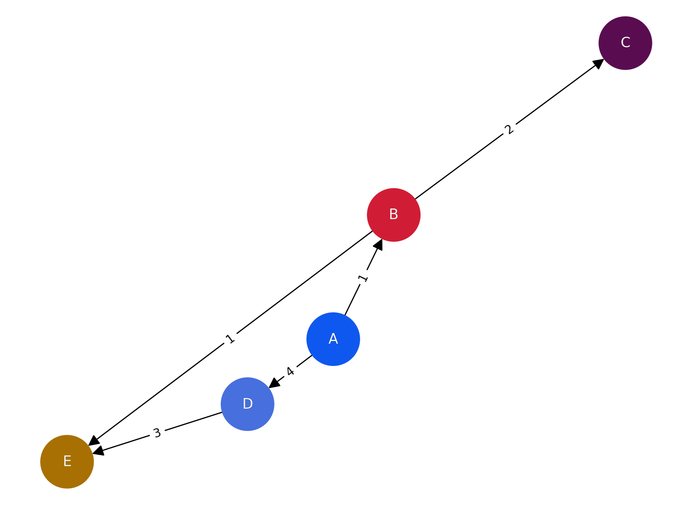

## 다익스트라 알고리즘  

> [English](README.md) , [Korean](README.ko.md)

### 알고리즘

- https://en.wikipedia.org/wiki/Dijkstra%27s_algorithm

### 코드  
- [dijkstra.py](dijkstra.py)

### 그래프 정의  

  

### 출력 결과  
```
최단 거리: {'A': 0, 'B': 1, 'C': 3, 'D': 4, 'E': 2}
```

- 각 결과는 시작 정점 A에서 해당 정점까지의 최단 거리 비용을 나타냅니다.  
- 예를 들어, `'C': 3`은 A에서 C까지의 최단 경로 비용이 3임을 의미합니다.  
- `'A': 0`은 다익스트라 알고리즘에서 시작 정점 A에서 A까지의 최단 거리가 0임을 뜻합니다.
  
