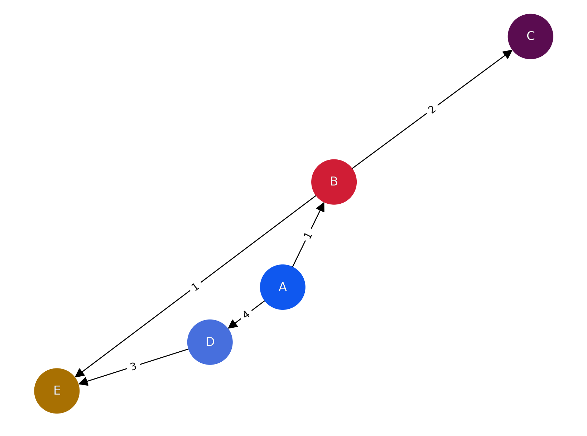

## Dijkstra’s Algorithm 
- https://en.wikipedia.org/wiki/Dijkstra%27s_algorithm

### Code
- [dijkstra.py](dijkstra.py)

### Graph definition



### Output
```
the shortest distance: {'A': 0, 'B': 1, 'C': 3, 'D': 4, 'E': 2}
```
- Each result refers to the cost of the shortest distance from the starting vertex A to that point.
- For example, 'C': 3 means that the cost of the shortest route from A to C is 3.
- 'A': The meaning of 0 means that the shortest distance from the starting vertex A to A in the Dyckstra algorithm is 0.


